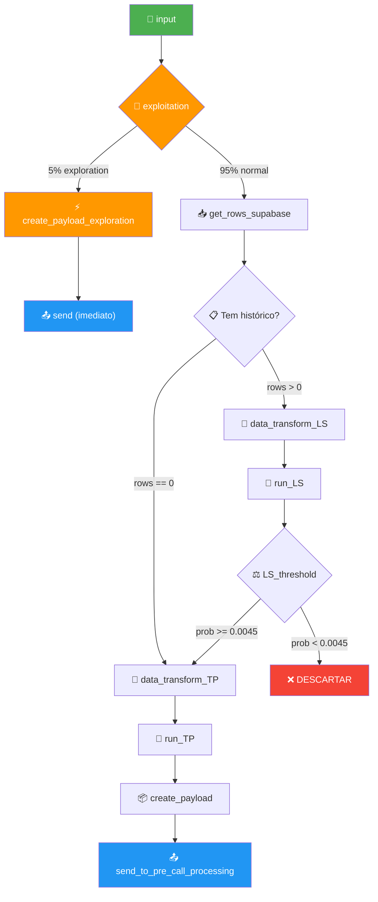

# Workflow: `call_predict`

> **Objetivo**: Receber um lead via webhook, avaliar sua probabilidade de atendimento (Lead Scoring) e determinar o melhor horário para ligar (Timing Predict), enviando os qualificados para o workflow `pre_call_processing`.
> **URL Produção**: `https://call-predict-github.bkpxmb.easypanel.host/`
> **Repositório**: `https://github.com/Sparkozzy/call_predict.git` (main branch)

---

## Visão Geral do Fluxo



### Caminhos possíveis:

| Caminho | Descrição |
|---|---|
| **Exploration** | `input` → `exploitation` → `create_payload` → `send` (pula ML e Supabase) |
| **Sem histórico** | `input` → `exploitation` → `get_rows` → pula LS → `data_transform_TP` → `run_TP` → `create_payload` → `send` |
| **Aprovado pelo LS** | `input` → `exploitation` → `get_rows` → `data_transform_LS` → `run_LS` → `ls_threshold` → `data_transform_TP` → `run_TP` → `create_payload` → `send` |
| **Descartado pelo LS** | `input` → `exploitation` → `get_rows` → `data_transform_LS` → `run_LS` → `ls_threshold` → ❌ FIM |

---

## Variáveis de Ambiente (`.env`)

| Variável | Valor | Descrição |
|---|---|---|
| `EXPLORATION_RATE` | `0.05` | Taxa de exploration (5%) |
| `LS_THRESHOLD` | `0.0045` | Threshold mínimo do Lead Scoring |
| `TP_FORECAST_HOURS` | `24` | Janela de simulação do Timing Predict |
| `TP_BLOCKED_START` | `23` | Início do período proibido (hora) |
| `TP_BLOCKED_END` | `6` | Fim do período proibido (hora) |
| `MINDFLOW_WEBHOOK_URL` | `https://call-github.bkpxmb.easypanel.host/webhook` | Endpoint do pre_call_processing |
| `PROJECT_PROD_URL` | `https://call-predict-github.bkpxmb.easypanel.host/` | URL deste projeto (Call Predict) |
| `WEBHOOK_API_KEY` | *(já existe)* | Chave de API para o pre_call_processing |

---

## Detalhamento dos Nós

### Nó 1: `call_predict_input`

**Tipo:** Webhook Receiver (FastAPI endpoint)
**Step name:** `call_predict_input`

**Payload de entrada:**
```json
{
  "numero": "+5548996027108",
  "agent_id": "agent_1e4cfa23e3910c557d82167949",
  "nome": "João Silva",
  "email": "joao@example.com",
  "Prompt_id": "24",
  "contexto": "Opcional: contexto da conversa",
  "empresa": "Opcional: nome da empresa",
  "segmento": "Opcional: segmento de atuação"
}
```

**Ações:**
1. Validação Pydantic (numero, agent_id, nome, email, Prompt_id + opcionais: contexto, empresa, segmento)
2. Validação de negócio: `numero` deve iniciar com `+`
3. Criação do registro mestre em `workflow_executions` (status: `PENDING`)
4. Enfileiramento no Redis/ARQ
5. Resposta: `202 Accepted`

**Output para próximo nó:** `{ numero, agent_id, nome, email, Prompt_id, execution_id }`

---

### Nó 2: `call_predict_exploitation`

**Tipo:** Decisão probabilística
**Step name:** `call_predict_exploitation`

**Lógica:**
```python
import random
is_exploration = random.random() < float(os.getenv("EXPLORATION_RATE", "0.05"))
```

**Comportamento:**
- Se `is_exploration = True`:
  - **Pula TODOS os nós seguintes** (não busca dados no Supabase, não roda ML).
  - Liga na **próxima hora válida** fora do período proibido (23h–6h).
  - Registra em `model_executions` com `is_exploration = True` e campos de ML como `null`.
  - Vai direto para `create_payload` → `send`.
- Se `is_exploration = False`:
  - Segue o fluxo normal → `get_rows`.

**Cálculo da próxima hora válida (exploration):**
```python
now_br = datetime.now(ZoneInfo("America/Sao_Paulo"))
TP_BLOCKED_START = int(os.getenv("TP_BLOCKED_START", "23"))
TP_BLOCKED_END = int(os.getenv("TP_BLOCKED_END", "6"))

# Verificar se a hora atual é válida
hora_atual = now_br.hour
if hora_atual >= TP_BLOCKED_START or hora_atual <= TP_BLOCKED_END:
    # Avançar até a próxima hora válida (7h)
    quando_ligar = now_br.replace(hour=TP_BLOCKED_END + 1, minute=0, second=0, microsecond=0)
    if quando_ligar <= now_br:
        quando_ligar += timedelta(days=1)
else:
    # Hora atual é válida → ligar imediatamente
    quando_ligar = None  # sem quando_ligar = execução imediata no MindFlow
```

**Registro em `model_executions`:**
```json
{
  "model_id": "exploration_control",
  "model_name": "Grupo de Controle",
  "model_version": "1.0.0",
  "to_number": "+5548996027108",
  "agent_id": "agent_xxx",
  "ls_probabilidade": null,
  "ls_decisao": null,
  "tp_horario_escolhido": null,
  "tp_probabilidade_pico": null,
  "is_exploration": true
}
```

**Registro em `workflow_step_executions`:**
```json
{
  "step_name": "call_predict_exploitation",
  "status": "SUCCESS",
  "output_data": { "is_exploration": true, "destino": "envio_direto" }
}
```

---

### Nó 3: `call_predict_get_rows`

**Tipo:** Fetch de dados (Supabase)
**Step name:** `call_predict_get_rows`

> ⚠️ **Só executa se `is_exploration = False`.**

**Lógica:**
- Query na tabela `Retell_calls_Mindflow`
- Filtro: `to_number == numero`
- Ordenação: `created_at DESC` (mais recentes primeiro)
- Limite: **150** linhas
- Colunas necessárias: `to_number, created_at, disconnection_reason`
- **Pós-query**: Reverter para ordem cronológica (`ASC`) no código para cálculos corretos

**Query Supabase (Python SDK):**
```python
response = supabase.table("Retell_calls_Mindflow") \
    .select("to_number, created_at, disconnection_reason, call_id") \
    .eq("to_number", numero) \
    .order("created_at", desc=True) \
    .limit(150) \
    .execute()

# Deduplicação por call_id (manter o evento mais recente de cada ligação)
seen_call_ids = set()
deduplicated_rows = []
for row in response.data:
    c_id = row.get("call_id")
    if c_id:
        if c_id not in seen_call_ids:
            deduplicated_rows.append(row)
            seen_call_ids.add(c_id)
    else:
        deduplicated_rows.append(row)

# Reverter para ASC (cronológico) para os cálculos de features
rows = list(reversed(deduplicated_rows))
```

**Decisão pós-fetch:**
- Se `rows` está vazio → **pular Lead Scoring** e ir direto para `data_transform_TP`
- Se `rows` tem dados → seguir para `data_transform_LS`

**Registro em `workflow_step_executions`:**
```json
{
  "step_name": "call_predict_get_rows",
  "status": "SUCCESS",
  "output_data": { "rows_found": 15, "tem_historico": true }
}
```

**Output para próximo nó:** `{ rows: List[dict], numero, agent_id, nome, email, Prompt_id, execution_id }`

---

### Nó 4: `call_predict_data_transform_ls`

**Tipo:** ETL / Feature Engineering
**Step name:** `call_predict_data_transform_ls`

> ⚠️ **Só executa se `rows` NÃO estiver vazio (lead com histórico).**

**Objetivo:** Transformar o histórico de chamadas em um **vetor de features** para o modelo Lead Scoring.

**Tratamento de `no-answer`:** Antes de calcular as features, mapear `no-answer` → `dial_no_answer`:
```python
for row in rows:
    if row["disconnection_reason"] == "no-answer":
        row["disconnection_reason"] = "dial_no_answer"
```

**Features produzidas (20 colunas):**

| # | Feature | Tipo Esperado pelo Modelo | Cálculo |
|---|---|---|---|
| 1 | `ddd` | `category` | Extraído de `numero`: `+55XX...` → `XX` |
| 2 | `Regiao` | `category` | Mapeamento DDD → Estado (tabela fixa) |
| 3 | `n_tentativas_anteriores` | `int64` | `len(rows)` (total de registros únicos por `call_id`) |
| 4 | `horas_desde_primeiro_contato` | `float64` | `(agora_br - primeiro_created_at).total_seconds() / 3600` |
| 5 | `n_voicemail_reached_anteriores` | `int64` | Contagem de `disconnection_reason == 'voicemail_reached'` |
| 6 | `n_dial_no_answer_anteriores` | `int64` | Contagem de `disconnection_reason == 'dial_no_answer'` (inclui `no-answer` mapeado) |
| 7 | `n_inactivity_anteriores` | `int64` | Contagem de `disconnection_reason == 'inactivity'` |
| 8 | `N_invalid_destination_anteriores` | `int64` | Contagem de `disconnection_reason == 'invalid_destination'` |
| 9 | `N_user_hangup_anteriores` | `int64` | Contagem de `disconnection_reason == 'user_hangup'` |
| 10 | `N_user_declined_anteriores` | `int64` | Contagem de `disconnection_reason == 'user_declined'` |
| 11 | `N_telephony_provider_permission_denied_anteriores` | `int64` | Contagem |
| 12 | `N_dial_busy_anteriores` | `int64` | Contagem |
| 13 | `N_telephony_provider_unavailable_anteriores` | `int64` | Contagem |
| 14 | `N_agent_hangup_anteriores` | `int64` | Contagem |
| 15 | `N_error_asr_anteriores` | `int64` | Contagem |
| 16 | `N_error_retell_anteriores` | `int64` | Contagem |
| 17 | `N_dial_failed_anteriores` | `int64` | Contagem |
| 18 | `N_max_duration_reached_anteriores` | `int64` | Contagem |
| 19 | `N_ivr_reached_anteriores` | `int64` | Contagem |
| 20 | `ultima_disconnection_reason` | `category` | `rows[-1]['disconnection_reason']` (já com `no-answer` mapeado) |

**Lógica de cálculo:**

```python
now_br = datetime.now(ZoneInfo("America/Sao_Paulo"))

n_tentativas = len(rows)
primeiro_created_at = parse_to_br(rows[0]["created_at"])
horas_desde_primeiro = (now_br - primeiro_created_at).total_seconds() / 3600
ultima_disconnection = rows[-1]["disconnection_reason"] or "primeiro_contato"

# Contagem de cada razão
for reason in REASONS:
    count = sum(1 for r in rows if r["disconnection_reason"] == reason)

# DDD e Região
ddd = numero[3:5]  # "+55XX..." → "XX"
regiao = DDD_TO_STATE.get(ddd, "DESCONHECIDO")
```

**Pós-processamento:**
- `fillna(0)` para todas as features numéricas
- Cast de `ddd`, `Regiao`, `ultima_disconnection_reason` para `category`
- **🔴 PENDENTE: Definir categorias do treino** (ver Questão Aberta Q1)

---

### Nó 5: `call_predict_run_ls`

**Tipo:** Inferência ML (XGBoost)
**Step name:** `call_predict_run_ls`

> ⚠️ **Só executa se lead tem histórico.**

**Lógica:**
```python
model_ls = ctx["model_ls"]  # Singleton carregado no startup
df = pd.DataFrame([features_ls])  # DataFrame de 1 linha

# Cast categorias com as categorias do treino
for col in ["ddd", "Regiao", "ultima_disconnection_reason"]:
    df[col] = df[col].astype("category")
    # 🔴 PENDENTE: .cat.set_categories(TREINO_CATS_LS[col])

probabilidade = model_ls.predict_proba(df)[0][1]
decisao = "LIGAR" if probabilidade >= LS_THRESHOLD else "DESCARTAR"
```

**Registro em `model_executions`:**
```json
{
  "model_id": "lead_scoring_v1",
  "model_name": "XGBoost Lead Scoring",
  "model_version": "1.0.0",
  "to_number": "+5548996027108",
  "agent_id": "agent_xxx",
  "ls_probabilidade": 0.0123,
  "ls_decisao": "LIGAR",
  "is_exploration": false
}
```

**Registro em `workflow_step_executions`:**
```json
{
  "step_name": "call_predict_run_ls",
  "output_data": { "probabilidade": 0.0123, "decisao": "LIGAR" }
}
```

---

### Nó 6: `call_predict_ls_threshold`

**Tipo:** Decisão / Gate
**Step name:** `call_predict_ls_threshold`

> ⚠️ **Só executa se lead tem histórico (após run_LS).**

**Lógica:**
```python
LS_THRESHOLD = float(os.getenv("LS_THRESHOLD", "0.0045"))

if probabilidade < LS_THRESHOLD:
    # Lead descartado
    # Atualizar workflow_executions → status = "SUCCESS"
    # output_data = { "decisao": "DESCARTAR", "motivo": "ls_threshold" }
    return  # Encerra o fluxo
```

**Registro em `workflow_step_executions`:**
```json
{
  "step_name": "call_predict_ls_threshold",
  "status": "SUCCESS",
  "output_data": {
    "threshold": 0.0045,
    "probabilidade": 0.0123,
    "passou": true
  }
}
```

> **Nota:** Quando o lead é descartado, o workflow mestre termina com `SUCCESS` (não é erro, é uma decisão válida).

---

### Nó 7: `call_predict_data_transform_tp`

**Tipo:** ETL / Feature Engineering
**Step name:** `call_predict_data_transform_tp`

> Executa quando: LS aprovado **OU** lead sem histórico (pulo do LS).

**Objetivo:** Preparar features para o modelo Timing Predict.

**Features produzidas (6 colunas):**

| # | Feature | Tipo | Cálculo |
|---|---|---|---|
| 1 | `ddd` | `category` | Extraído de `numero[3:5]` |
| 2 | `hora_contato` | `int` | Hora atual em BRT (`now_br.hour`) |
| 3 | `dia_semana` | `category` | Dia da semana atual (0=Seg, 6=Dom) |
| 4 | `densidade_tentativas` | `float` | `n_tentativas / (horas_desde_primeiro_contato + 1)` |
| 5 | `pressao_recente` | `float` | `n_tentativas / (horas_desde_ultimo_contato + 1)` |
| 6 | `hora_ultimo_contato` | `float` | Hora da última chamada em BRT, ou `-1` se primeiro contato |

**Cálculos derivados:**
```python
now_br = datetime.now(ZoneInfo("America/Sao_Paulo"))

hora_contato = now_br.hour
dia_semana = now_br.weekday()  # 0=segunda, 6=domingo

if rows:  # tem histórico
    ultimo_created_at = parse_to_br(rows[-1]["created_at"])
    horas_desde_ultimo = (now_br - ultimo_created_at).total_seconds() / 3600
    hora_ultimo_contato = ultimo_created_at.hour
    # Reutilizar horas_desde_primeiro do transform_LS
else:  # sem histórico (primeiro contato)
    n_tentativas = 0
    horas_desde_primeiro_contato = 0.0
    horas_desde_ultimo = 0.0
    hora_ultimo_contato = -1

densidade_tentativas = round(n_tentativas / (horas_desde_primeiro_contato + 1), 4)
pressao_recente = round(n_tentativas / (horas_desde_ultimo + 1), 4)

ddd = numero[3:5]
```

**Cast de categorias:**
- `ddd` → `category` (🔴 PENDENTE: categorias do treino TP)
- `dia_semana` → `str` → `category` (🔴 PENDENTE: categorias do treino TP)

---

### Nó 8: `call_predict_run_tp`

**Tipo:** Inferência ML (XGBoost) — Simulação de 24 horas
**Step name:** `call_predict_run_tp`

**Lógica principal:**
```python
TP_FORECAST_HOURS = int(os.getenv("TP_FORECAST_HOURS", "24"))
TP_BLOCKED_START = int(os.getenv("TP_BLOCKED_START", "23"))
TP_BLOCKED_END = int(os.getenv("TP_BLOCKED_END", "6"))

model_tp = ctx["model_tp"]
resultados = []

for i in range(1, TP_FORECAST_HOURS + 1):
    proxima_hora = (hora_contato + i) % 24
    novo_dia = (dia_semana + ((hora_contato + i) // 24)) % 7

    # Pular horários proibidos (23:00 às 06:00)
    if proxima_hora >= TP_BLOCKED_START or proxima_hora <= TP_BLOCKED_END:
        continue

    cenario = base_features.copy()
    cenario["hora_contato"] = proxima_hora
    cenario["dia_semana"] = str(novo_dia)

    df_sim = pd.DataFrame([cenario])

    # Cast categorias
    for col in ["ddd", "dia_semana"]:
        df_sim[col] = df_sim[col].astype(str).astype("category")
        # 🔴 PENDENTE: .cat.set_categories(TREINO_CATS_TP[col])

    prob = model_tp.predict_proba(df_sim)[0][1]

    resultados.append({
        "hora": proxima_hora,
        "dia": novo_dia,
        "probabilidade": prob,
        "offset_horas": i
    })

# Selecionar o horário com maior probabilidade
melhor = max(resultados, key=lambda x: x["probabilidade"])
```

**Cálculo do `quando_ligar` (ISO 8601 com timezone):**
```python
from datetime import timedelta

quando_ligar = now_br + timedelta(hours=melhor["offset_horas"])
# Ajustar para o início exato da hora (minutos=0, segundos=0)
quando_ligar = quando_ligar.replace(minute=0, second=0, microsecond=0)
quando_ligar_iso = quando_ligar.isoformat()
# Ex: "2026-04-24T15:00:00-03:00"
```

**Registro em `model_executions`:**

Para leads **com histórico** (UPDATE do registro criado no run_LS):
```json
{
  "tp_horario_escolhido": 15,
  "tp_probabilidade_pico": 0.087
}
```

Para leads **sem histórico** (INSERT novo, pois não houve run_LS):
```json
{
  "model_id": "timing_predict_v1",
  "model_name": "XGBoost Timing Predict",
  "model_version": "1.0.0",
  "to_number": "+5548996027108",
  "agent_id": "agent_xxx",
  "ls_probabilidade": null,
  "ls_decisao": null,
  "tp_horario_escolhido": 15,
  "tp_probabilidade_pico": 0.087,
  "is_exploration": false
}
```

**Registro em `workflow_step_executions`:**
```json
{
  "step_name": "call_predict_run_tp",
  "output_data": {
    "melhor_hora": 15,
    "melhor_dia": 3,
    "probabilidade_pico": 0.087,
    "quando_ligar": "2026-04-24T15:00:00-03:00",
    "cenarios_avaliados": 16
  }
}
```

---

### Nó 9: `call_predict_create_payload`

**Tipo:** Transformação / Montagem
**Step name:** `call_predict_create_payload`

**Lógica:** Montar o payload no formato exigido pela skill MindFlow.

```python
payload = {
    "workflow_name": "pre_call_processing",
    "execution_id": execution_id,
    "numero": numero,
    "nome": nome,
    "email": email,
    "agent_id": agent_id,
    "Prompt_id": Prompt_id,
    "contexto": contexto,
    "empresa": empresa,
    "segmento": segmento,
    "quando_ligar": quando_ligar_iso
}
```

> Todos os campos (`nome`, `email`, `Prompt_id`, `contexto`, `empresa`, `segmento`) vêm do payload de entrada do webhook, conforme decisão Q2 e atualização.

---

### Nó 10: `call_predict_send`

**Tipo:** HTTP Request (saída)
**Step name:** `call_predict_send`

**Lógica:**
```python
import httpx

async with httpx.AsyncClient() as client:
    response = await client.post(
        os.getenv("MINDFLOW_WEBHOOK_URL"),
        json=payload,
        headers={
            "X-API-Key": os.getenv("WEBHOOK_API_KEY"),
            "Content-Type": "application/json"
        },
        timeout=30.0
    )
```

**Resposta esperada:** `202 Accepted`

**Finalização do workflow mestre:**
- Atualizar `workflow_executions` → `status = SUCCESS`
- `output_data`: payload enviado + response status

---

## Tabelas de Monitoramento

### 1. `workflow_executions` (já existe)

Cada chamada ao webhook cria **1 registro mestre**.

| Campo | Valor |
|---|---|
| `workflow_name` | `call_predict` |
| `status` | `PENDING` → `RUNNING` → `SUCCESS` / `FAILED` |
| `input_data` | `{ "numero", "agent_id", "nome", "email", "Prompt_id" }` |
| `output_data` | Resultado final (payload enviado ou motivo de descarte) |

### 2. `workflow_step_executions` (já existe)

Cada nó gera **1 registro de step** (via `run_step_with_retry`).

**Steps possíveis por execução, por caminho:**

| Step | Exploration | Sem histórico | Normal (LS ok) | Descartado |
|---|---|---|---|---|
| `call_predict_input` | ✅ | ✅ | ✅ | ✅ |
| `call_predict_exploitation` | ✅ | ✅ | ✅ | ✅ |
| `call_predict_get_rows` | ❌ | ✅ | ✅ | ✅ |
| `call_predict_data_transform_ls` | ❌ | ❌ | ✅ | ✅ |
| `call_predict_run_ls` | ❌ | ❌ | ✅ | ✅ |
| `call_predict_ls_threshold` | ❌ | ❌ | ✅ | ✅ |
| `call_predict_data_transform_tp` | ❌ | ✅ | ✅ | ❌ |
| `call_predict_run_tp` | ❌ | ✅ | ✅ | ❌ |
| `call_predict_create_payload` | ✅ | ✅ | ✅ | ❌ |
| `call_predict_send` | ✅ | ✅ | ✅ | ❌ |

### 3. `model_executions` (já existe)

**1 registro por execução** do workflow, contendo dados de ambos os modelos.

---

## Estrutura de Arquivos (Proposta)

```
Call_predict/
├── main.py                  # FastAPI — endpoint POST /webhook/predict
├── worker.py                # ARQ Worker — startup/shutdown (já existe)
├── services.py              # Orquestrador — process_call_predict()
├── ml_logic.py              # ETL + inferência (transform_ls, transform_tp, run_ls, run_tp)
├── schemas.py               # Pydantic models
├── models/
│   ├── xgboost_LS_model.pkl
│   └── xgboost_model_TP_V1.pkl
├── .env
├── requirements.txt
└── docs/
    ├── architecture.md
    ├── conventions.md
    ├── supabase_data_guide.md
    └── workflow.md           # ← Este documento
```

---

## Decisões Registradas

> Respostas do usuário às questões abertas. Todas as decisões abaixo são **definitivas** e devem ser seguidas na implementação.

| # | Questão | Decisão |
|---|---|---|
| Q2 | Dados faltantes (`nome`, `email`, `Prompt_id`) | **Opção A** — Incluir como campos obrigatórios no payload de entrada do webhook |
| Q3 | `disconnection_reason = 'no-answer'` | **Opção A** — Mapear para `dial_no_answer` antes de calcular features |
| Q4 | Comportamento do grupo exploration | **Opção B** — Ligar na próxima hora válida fora do período proibido. **Pula todos os nós** (Supabase, ML). |
| Q5 | Lead sem histórico (primeiro contato) | **Pular Lead Scoring** e ir direto para Timing Predict. O modelo foi treinado com leads sem histórico. |
| Q6 | Referência temporal de `horas_desde_primeiro_contato` | **Opção A** — `agora_BRT - primeiro_created_at` |

---

## 🔴 Questão Pendente (BLOQUEANTE)

### Q1: Categorias dos modelos treinados

Os modelos XGBoost foram treinados com colunas categóricas. **Sem a lista exata de categorias, a inferência vai falhar.**

**O que preciso de você:**

Abra o notebook do Colab onde os modelos foram treinados e execute o seguinte código:

```python
# Para o modelo Lead Scoring (LS):
print("=== CATEGORIAS LS ===")
for col in X_train_encoded.select_dtypes(include="category").columns:
    print(f"{col}: {list(X_train_encoded[col].cat.categories)}")

# Para o modelo Timing Predict (TP):
print("=== CATEGORIAS TP ===")
for col in X_train_encoded.select_dtypes(include="category").columns:
    print(f"{col}: {list(X_train_encoded[col].cat.categories)}")
```

**Cole o output aqui.** Preciso das listas exatas de:
- DDDs conhecidos pelo modelo LS e TP
- Regiões (estados) conhecidos pelo modelo LS
- `ultima_disconnection_reason` conhecidos pelo modelo LS
- `dia_semana` conhecidos pelo modelo TP
